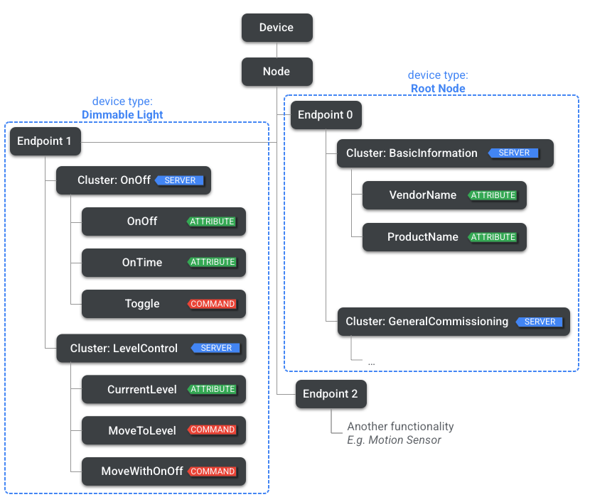
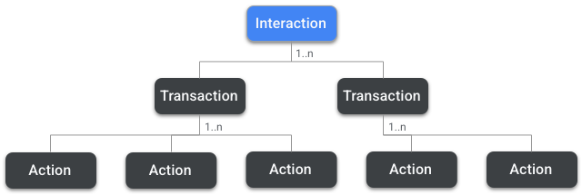
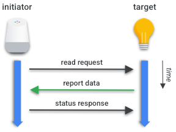
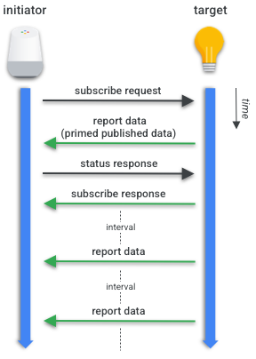
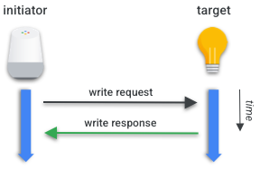
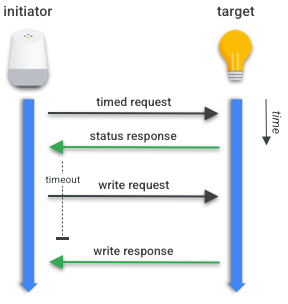

# Matter
## What is Matter
Matter is a standard for smart home technology that allows devices to work with any other Matter-certified ecosystem using a single protocol.

Why use Matter:
- Lower latency and higher reliability than cloud-to-cloud connection as Matter is an IP-based local connectivity protocol
- Lower costs
- Consistent setup experience across all Matter-enabled devices
- Fast and easy development: no need to link accounts, users just need to link the smart home device to the controller app

Matter's goal is to be an interoperable standard, gradually replacing proprietary protocols for smart home ecosystems (e.g. Apple HomeKit, Amazon's Alexa Smart Home, Google Weave).

Matter also supports *bridging* of other smart home technologies (e.g. Zigbee), which means that devices using these protocols may be operated as if they were Matter devices through a Bridge. 

## Device Data Model
Devices in Matter have a well defined data model (DM), which is a hierarchical modeling of a device's features. At the top level of this hierarchy there is a **device**.

### Nodes
All devices are composed of **nodes**. A node is a unique identifiable and addressable resource in a network that a user can perceive as functionally whole. Network communication in Matter originates and terminates at a node.

Note that a node is just a logical participant in the matter network. It can be another device, such as a phone app, smart display or smart speaker (all of these acting as controllers). It can also be a matter controller running on a server, like a backend service exposing an HTTP API like `GET /devices/:lightId/state`. Internally, the server receives the HTTP request, acts as a matter initiator, sends a read request action (explained later in the text) to the device and returns the result to the HTTP client. It is important to understand that this server still needs to be commissioned into the matter fabric, have credentials (certificates/fabric membership) and speak matter protocols. This means it is not just an HTTP service, it is an *HTTP service wrapping a matter controller*.

### Endpoints
Nodes are a collection of **endpoints**. Each endpoint has a feature set. For example, one endpoint might relate to a lighting functionality while another relates to motion detection.

### Node roles
A **node role** is a set of related behaviors. Each node may have one or more roles. They can include:
- Commissioner: a node that performs commissioning
- Controller: a node that can control one or more nodes.
- Controlee: a node that can be controlled by one or more nodes. Most devices can be a controlee, except those that have the controller role.
- OTA (over the air) provider: a node that can provide OTA software updates
- OTA requestor: a node that can request OTA software updates

### Clusters
Within an endpoint a node has one or more **clusters**. Clusters group specific functionality - e.g. on/off cluster on smart plug

A node may have several endpoints, each creating an instance of the same functionality - e.g. a light fixture may expose independent control of individual lights or a power strip may expose control of individual sockets.

### Attributes
At the last level we have **attributes**. Attributes are states held by the node, such as the current level attribute of a level control cluster. Attributes may be defined as different data types such as uint8, strings or arrays.

### Commands
**Commands** are actions that may be performed. Commands are verb-like, such as *lock door* on a Door Lock cluster. Commands may generate responses and results. In Matter, responses are also defined as commands that are sent in the reverse direction.

### Events
**Events** can be though of as records of past state transitions. While attributes represent the current states, events are a journal of the past and include a monotonically increasing counter, a timestamp and a priority.



In the image above, the endpoint 0 is reserved for the **utility clusters**, which are clusters that enclose servicing functionality on an endpoint such as discovery, addressing, diagnostics and software update. The other clusters, called **application clusters**, support primary actions.

## Interaction model
The interaction model (IM) defines a node's data model relationship with the data model of other nodes - it's a common language for communication between DMs.

Nodes interact with each other by:
- Reading and subscribing to attributes and events
- Writing to attributes
- Invoking commands

Whenever a node establishes a communication sequence with another node, they create an **interaction** relationship. Interactions may be composed of one or more **transactions**. Transactions are composed of one or more **actions**. Actions are IM-level messages between nodes.



Several actions are supported on transactions:
- read request action: requests an attribute or event from another node
- report data action: carries the information back from the server to the client

### Initiators and targets
The node that initiates a transaction is the **initiator**, while the node that respond is the **target**.

### Groups
Nodes in matter may belong to a **group**. A group of devices is a mechanism for addressing and sending messages to several devices in the same action simultaneously. All nodes in a group share the same group id, a 16 bit integer.

### Paths
Whenever we want to interact with an attribute, event or command, we must specify the **path** for this interaction. Paths are the location of an attribute, event or command in the data model hierarchy of a node. Note that paths may also use groups or wildcard operators to address several nodes or clusters at the same time.

For example: when a user wants to shut down all lights, a voice assistant can establish a single interaction with several lights within a group instead of a sequence of individual interactions. If the initiator creates individual interactions with each light, it can generate human-perceptible latency in device responsiveness.

A path in matter can be assembled like this:

```
<path> = <node> <endpoint> <cluster> <attribute | event | command>
<path> = <group ID>        <cluster> <attribute | event | command>
```

Note that endpoint and cluster may also use wildcard operators.

### Timed and untimed transactions
There are two ways of writing to or invoking transactions: **timed** and **untimed**. Timed transactions set a maximum timeout for the action to be sent. This has the purpose of preventing an intercept attack on the transaction, which is important for devices that gate access to assets (e.g. garage openers and locks).

The downside of timed transactions is that they increase the complexity and number of actions, so they are not recommended for every transaction - only on critical operations.

### Types of transactions
#### Read transactions
In a **read transaction**, the first action that must be performed is the *read request action*. This is followed by a *report data action* and finally we have a *status response action*.



###### Read Request Action

The initiator queries a target, providing:
- Attribute requests: list of zero or more of the target's attributes. This list is composed of zero or more paths to the target's requested attributes.
- Event requests: list of zero or more paths to the target's requested events.

After the action is received by the target, it will assemble a report data action with the information.

##### Report Data Action
In this action the target responds with:
- Attribute reports: list of zero or more of the reported attributes requested.
- Event reports: list of zero or more reported events requested.
- Suppress response: flag that determines whether the status response to this action should be suppressed.
- Subscription ID: if this report is part of a subscribing transaction, it must include an identifier of the subscription transaction.

##### Status Response Action
Once the initiator receives the requested data, by default it must generate a status response action acknowledging the receipt of the reported data. If the supress response flag is used, then the status response action shouldn't be sent.

The status response action contains a status field either acknowledging the success of the operation or presenting a failure code.

#### Subscription transaction
An initiator can also subscribe to periodic updates of an attribute or event.



##### Subscribe Request Action
A subscribe request action contains:
- Min interval floor: the min interval between reports
- Max interval ceiling: the max interval between reports
- Attribute requests and event requests

##### Report Data Action
After the subscribe request, the target responds with a Report Data action containing the first batch of reported data called *primed published data*.

##### Status Response Action
The initiator acknowledges the report data action with a status response action sent to the target.

##### Subscribe Response Action
Once the target receives a status response action reporting no errors, it sends a subscribe response action.

##### Report Data action
The target will subsequently send report data actions periodically at the established intervals and the initiator responds to those until the subscribtion is lost or cancelled.

#### Write transactions
Write transactions are used to change an attribute value on a cluster.

##### Untimed Write Transaction


###### Write Request Action
In this Action the Initiator provides the Target with:
- Write Requests: list of one or more tuples containing Path and data.
- Timed Request: a flag that indicates whether this Action is part of a Timed Write Transaction.
- Suppress Response: a flag that indicates whether the Response Status Action should be suppressed.

###### Write Response Action
After the Target receives the Write Request Action it will finalize the transaction with a Write Response Action that carries:
- Write Responses: a list of paths and error codes for every Write Request sent on the Write Request Action.

##### Timed Write Transaction


###### Timed Request Action
A Initiator starts the Transaction sending this Action that contains:
- Timeout: how many milliseconds this transaction may remain open. During this period the next action sent by the Initiator will be considered valid.

Once the Timed Request Action is received, the Target must acknowledge the Timed Request Action with a Status Response Action. Once the Initiator receives a Status Response Action reporting no errors, it will send a Write Request Action.

###### Write Request Action and Write Response Action
Same as previously described.

## Commissionable Discovery vs Operational Discovery
### Comissionable Discovery
This is the process by which a brand new device (also called uncommissioned device) announces itself as available for commissioning. The device is not yet part of any matter fabric and advertises itself over BLE or IP (mDNS) with a flag saying it is ready for pairing. Controllers can find the device and initiate the commissioning flow. This process involves:
- Scanning for devices on the network or via BLE
- Retrieving a setup code / QR code / pairing code
- Establishing a secure session (PASE) to provision certificates and network credentials

### Operational Discovery
This is the process by which connection is established to a device that is already commissioned and part of a fabric. The key points are:
- The device is already operational and has certificates from its fabric
- Controllers can discover it to interact with it: read state, subscribe to updates or send commands
- Uses IP-based discovery (mDNS) or the fabric's operational network
- **No new commissioning happens**. It just announces that it exists and is ready for control

### Which one will we use
Since in our setup we plan to first commission the devices with Home Assistant and then add our matter.js controller as a second controller, we will use operational discovery.

## Fabric
In matter, a **fabric** is a secure network of devices and controllers that trust each other. Every device that is commissioned belongs to one fabric (initially) and a fabric defines who is allowed to control which devices.

In summary:
- Devices (lights, sensors etc) are the nodes
- Controllers (Home Assistant, nanomatter backend) are the admins or initiators
- Fabric: secure structure that connects all of them and governs their trust relationships

### Key concepts
#### Fabric ID
Every fabric has a unique, 64-bit identifier. It serves as the address of that network. Devices and controllers in the same fabric know they belong together.

#### Root certificate and certificates
Commissioning a device creates cryptographic certificates for that device. Certificates prove membership in the fabric and establish trust between nodes. Controllers also get certificates so the device knows they're authorized to talk to it.

#### Administrator/controller
A fabric can have one or more administrators (nodes may be commissioned on more than one fabric). Multi-admin does not create multiple fabrics. It means one fabric can have multiple controllers. In our case, Home Assistant is the first controller and creates the fabric when commissioning the devices. Our custom controller will join that same fabric using the multi-admin pairing code.

#### Device membership
Each device is member of a fabric. Devices respond to controllers that are part of the same fabric (they must trust them via certificates). If a controller is not in the fabric, it can't control the device.

#### Fabric index / Node ID
Each device has a node ID unique within the fabric. The fabric keeps track of all nodes (devices + controllers) it knows.

#### Operational credentials
Once commissioned, devices and controllers use operational credentials to communicate securely. These are different from the commissioning credentials as they allow encrypted communication during normal operations.